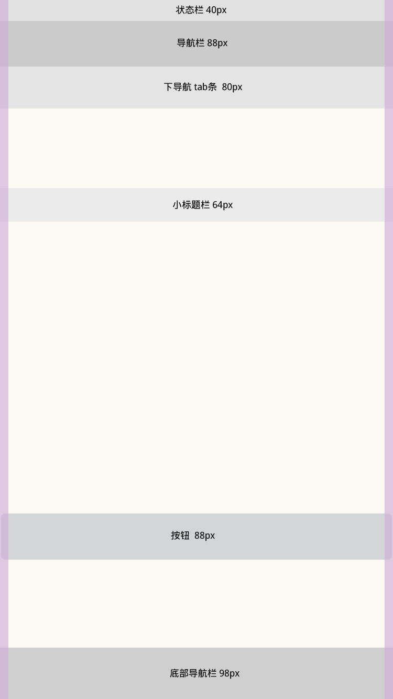

# iphone 布局
 

# 本节知识点
1. **布局**
2. **图标尺寸**

---

 
# 1. 布局

iphone 设计以 750x1334 为主导。

目的在于，750x1334的尺寸放大1.5倍是plus的尺寸：1080x1920。同时这个尺寸的切图能适配所有机型，好处在于替代以往每个机型切一套图的繁琐。

 
## 1.1布局控件

1. 根据移动端8px的原则，所有间距或标准尺寸都应为8px的倍数
 
2. 平台最小区域点击尺寸为：88x88px

以图文形式展示：

* **状态栏：40px**
* **导航栏：88px**
* **下导航 tab 条：80px**
* **小标题：64px**
* **按钮：88px**
* **底部导航：98px**

  

## 1.2具体机型有以下几种，可做参考：

 
# 2. 图标尺寸
| 设备 | App Store | 程序应用 | 主屏幕 | Spotligh 搜索 | 标签栏 | 工具栏和导航栏 |
| -- | -- | -- | -- | -- | -- | -- |
| iphone4s | 1024x1024px | 120x120px | 114x114px | 58x58px | 75x75px | 44x44px |
| iphone5~iphone5s | 1024x1024px | 120x120px | 114x114px | 58x58px | 75x75px | 44x44px |
| iphone6 | 1024x1024px | 120x120px | 114x114px | 58x58px | 75x75px | 44x44px |
| iphone6plus | 1024x1024px | 180x180px | 114x114px | 87x87px | 75x75px | 66x66px |

